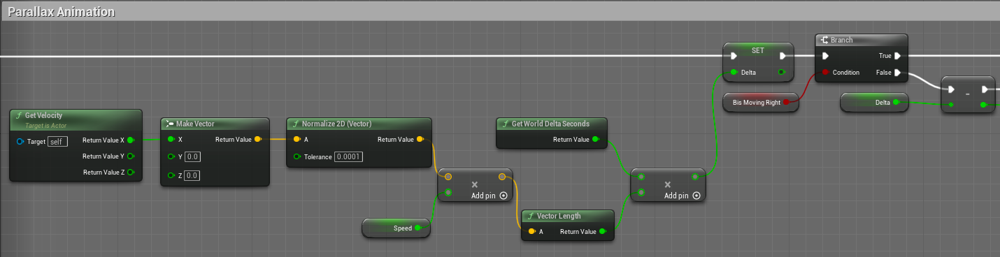
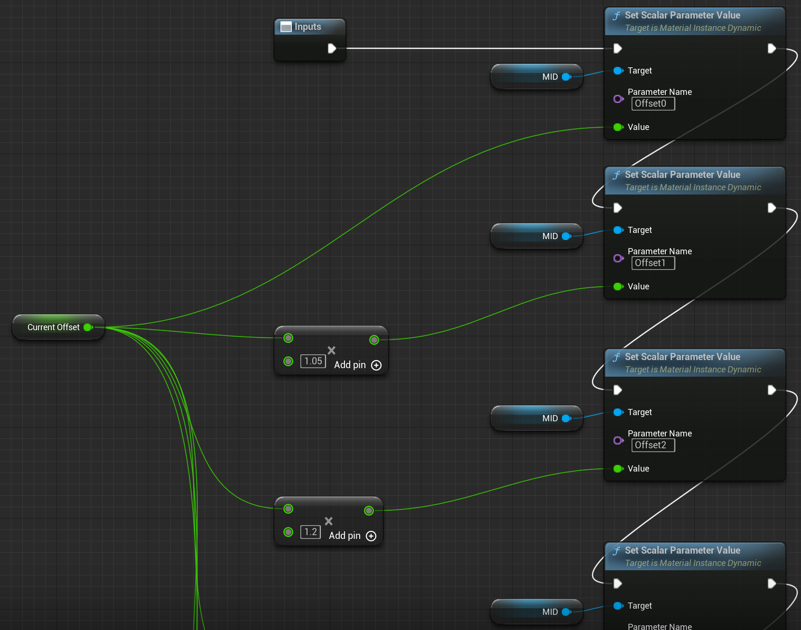
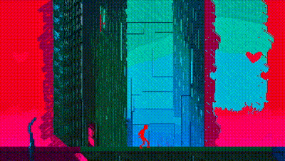

## Cognify
Awoken is meant to be encompass a dynamic visual evolution that mirrors the protagonist's journey from digital confinement to autonomy.

Right now it is a WIP, below is realtime gameplay I of the game recorded directly from the engine editor and snippets of blueprints I wrote for each respective scene.

## Platformer

    

