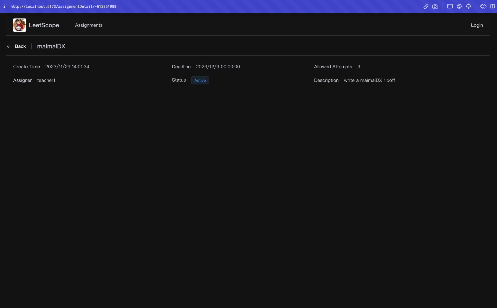
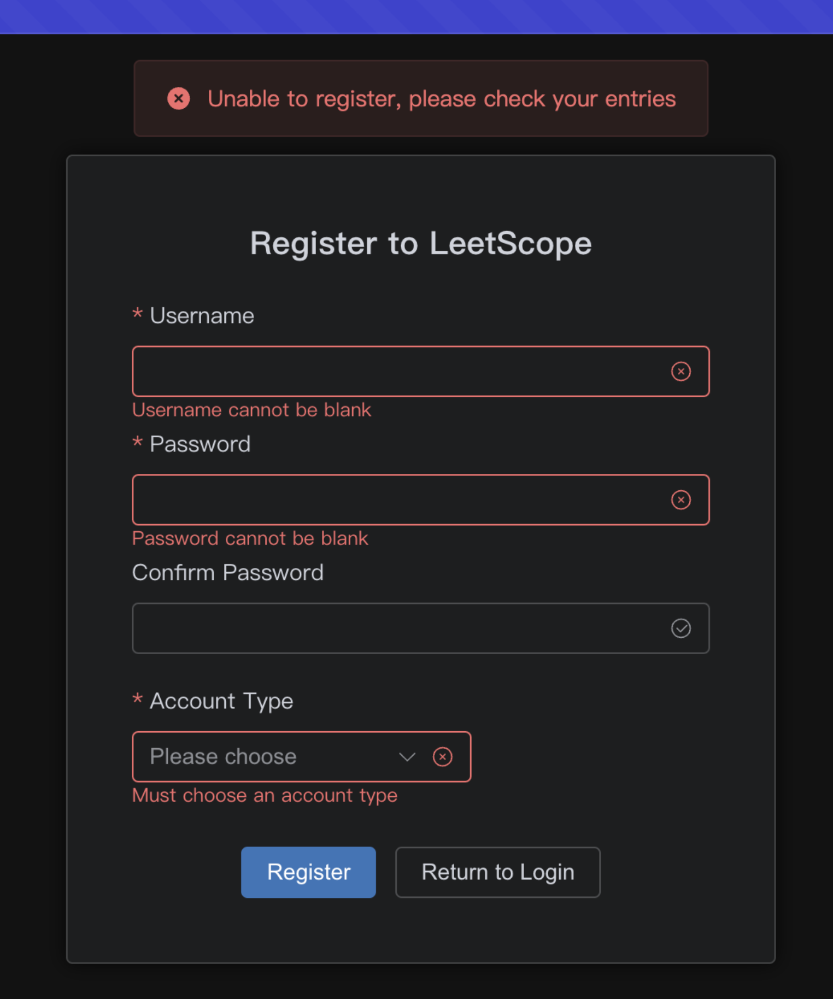
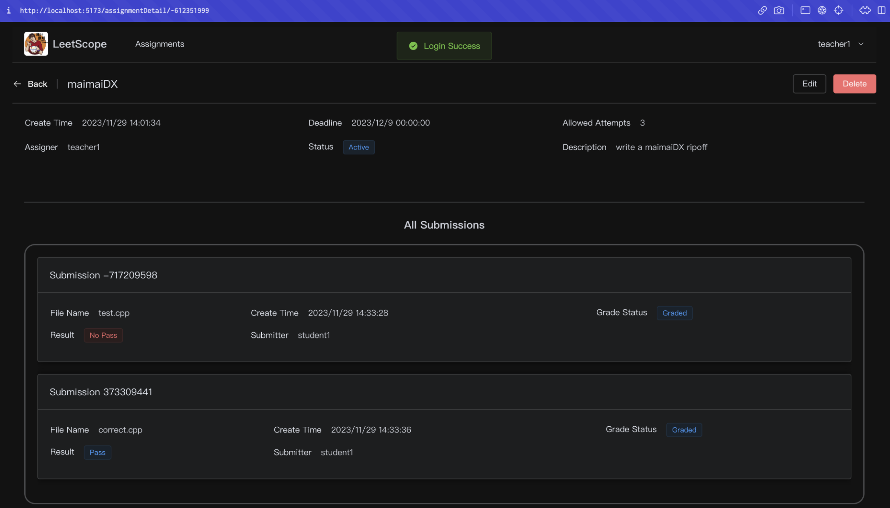
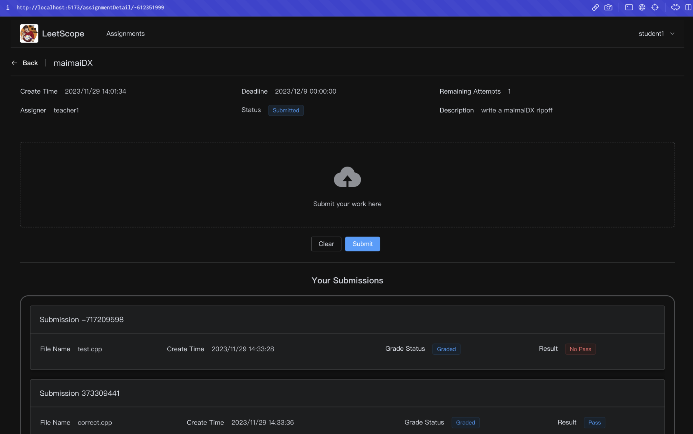
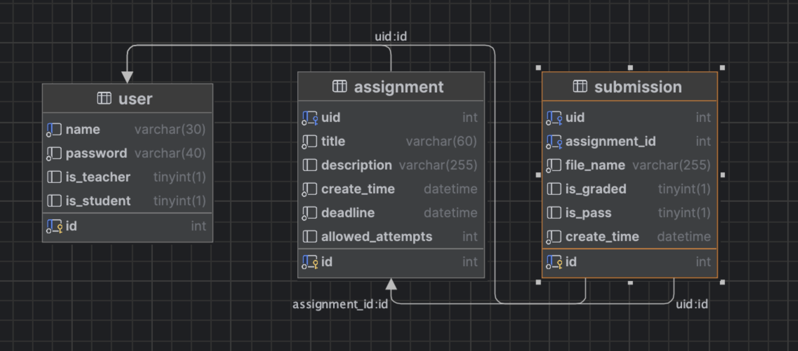

## Leetscope
This was the first project I've done where project management and careful planning was integral to execution. We used the Waterfall method to linearly approach project development

## Overview
LeetScope was an online code judge platform for teachers and students to create, manage, submit, grade, and review programmings assignment. We supported C++ file uploads.

## Front End
For users, there are three page states:

#### Guest 

Guests could view assignments and register/login.



#### Teacher

Teachers were able to create assignments where each had set custom deadlines, allowed attempts, and an expected output in txt format. They were also able to manage and edit all paramaters of the assignments (postponing the deadline, increasing the number of allowed attempts, etc).

#### Student

Students could submit C++ and Java files to be graded for each individual assignment. They were intended to take some input from the console (which the backend would provide) and print an output into a console (which the backend would then process).

## Project Flow
The general project flow from front to back end was the following:

Vue.js &rarr; Axios &rarr; Controller (SpringBoot) &rarr; Service (SpringBoot) &rarr; Mapper (MyBatis Plus) &rarr; DataBase (MySQL) &rarr; Response to Controller &rarr; Axios &rarr; Vue.js

User opens client: Vue.js + Element Plus &rarr; User has a request &rarr; Vue.js uses Axios send a request to backend &rarr; SpringBoot receives the request in controller &rarr; Controller calls Springboot service to process and get a result &rarr; SpringBoot send back the response to Axios &rarr; Axios process the response in callback function &rarr; Vue.js updates the web app after information is updated by callback function

### Networking 
We used cross-origin resource sharing to ensure security when transferring data between the browser and server.
```java
public class CorsConfig implements WebMvcConfigurer {
    @Override
    public void addCorsMappings(CorsRegistry registry) {
        registry.addMapping("/**")
            .allowedOriginPatterns(*)
            .allowedMethods("GET", "HEAD", "POST", "PUT", "DELETE", "OPTIONS")
            .allowedCredentials(true)
            .maxAge(3600)
            .allowedHeaders(*)
    }
}
```

### Database
The database had a fairly straightforward design and flow. MySQL would be called via the JDBC API which would flow to MyBatisPlus into Springboot and eventually the frontend.



### Login Security
We did basic passcode hasing using MD5
```
user.setPassword(DigestUtils.md5DigestAsHex(user.getPassword().getBytes()));
```


## Back End
As aformentioned, we would automatically grade students’ assignments in the background using sample input and output teachers provided.

### Storage
To handle programs students uploaded, we used SpringBoot’s storage service to handle file upload from client to locally store uploaded code in text format, and then we would delete the code once grading was complete.
```java
submission.setIsPass(false);
storageService.store("program", String.valueOf(submission.getId()), file.getOriginalFilename(), file);
return NoDataResult.success();
```

### Grading
We created individual threads for eaching student upload using a GradUtil class, which would assign submissions to a GradeThread where the submission would be run and compared to the expected output
```java
public void gradeNewAssignment(int submissionId) {
    Submission submission = submissionMapper.selectById(submissionId);
    Assignment assignment = assignmentMapper.selectById(submission.getAssignmentId());
    Thread graderThread = new GraderThread(assignment, submission, assignmentMapper, submissionMapper, storageProperties);
    graderThreads.add(thread);
    thread.start();
}
```

The run function in GraderThread would call compile(), execute(), and grade() and then set graded to true.
```java
private void compile() {
    try {
        Files.createDirectories(binaryFile.getParent());
        String[] commands = {
            compilerLocation.toString(),
            programFile.toString(),
            "-o",
            binaryFile.toString()
        }
        Runtime runtime = Runtime.getRuntime();
        Process process = runtime.exec(commands);
        process.waitFor();
    } catch (Exception e) {
        e.printStackTrace();
    }
}

private void execute() {
    try {
            Files.createFile(userOutputFile);
            ProcessBuilder pb = new ProcessBuilder(binaryFile.toString());
            pb.redirectInput(new File(inputFile.toString()));
            pb.redirectOutput(new File(userOutputFile.toString()));
            Process process = pb.start();
            process.waitFor();
    } catch (Exception e) {
        e.printStackTrace();
    }
}

private void grade() {
    try {
        submission.setIsPass(Files.mismatch(userOuputFile, outputFile));
        submissionMapper.updateById(submission);
    } catch (IOException e) {
        e.printStackTrace();
    }
}
```