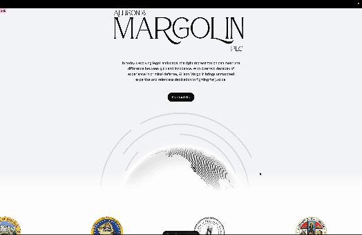

Author of bail motion that has freed client in felony case post-conviction after no-bail order.

Expert witness on 1 felony case and 2 civil cases.

Currently working on internal software for partial file extraction on iOS devices. Also working on a the next iteration of https://allisonmargolin.com, which will leverage WebGL with a map of the world and of california for an interactive experience. Demo shown below:

